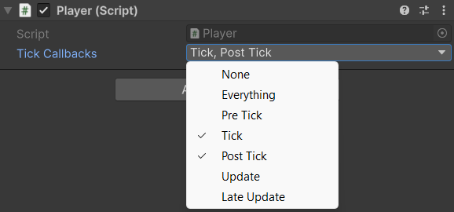

# TickNetworkBehaviour

## Description

This abstract class makes it easy to use the various tick events with simple overrides.

You can change the active event subscriptions through the inspector or through code with the `SetTickCallbacks` method.

## Settings

<figure><figcaption></figcaption></figure>

### :gear: **Tick Callbacks**

> The Tick Callbacks field lets you choose which timing events the component automatically subscribes to.
