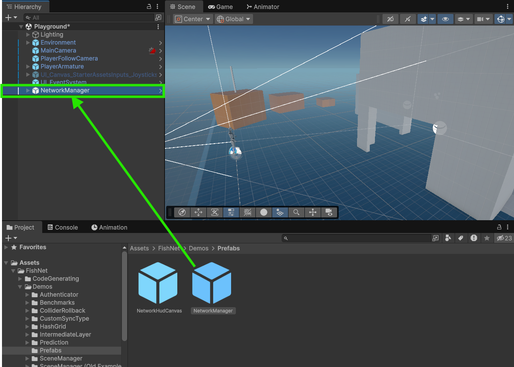
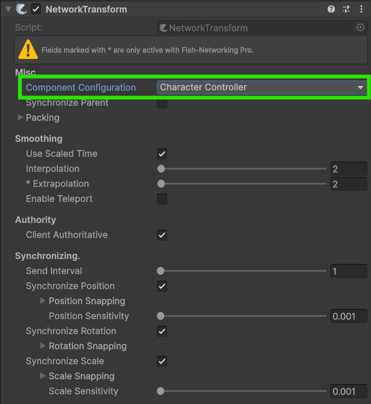
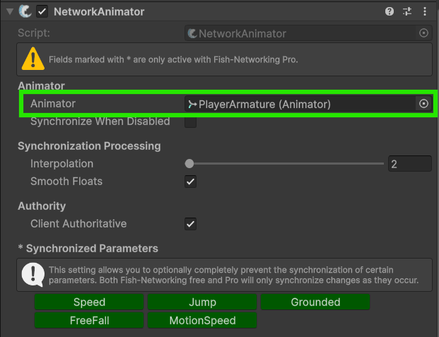
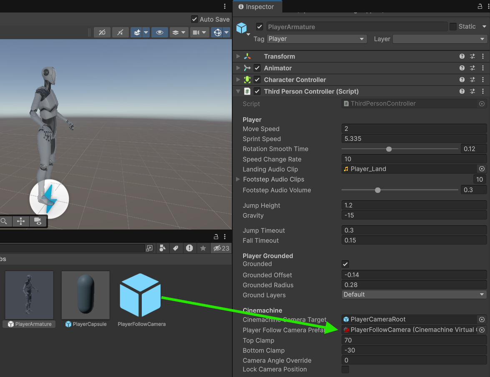
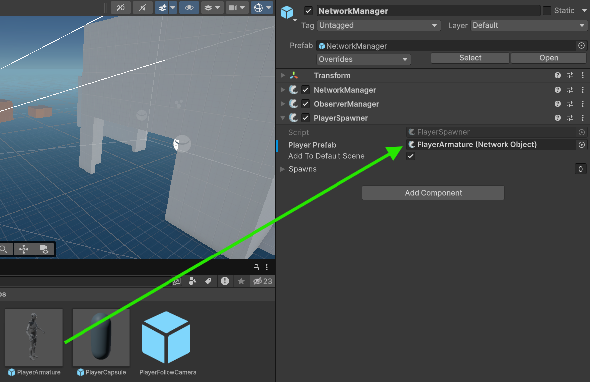
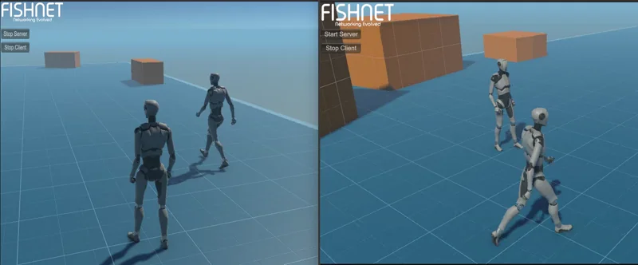

# Client Authoritative



### Before we begin

Don't forget to import the third person starter asset into your project and ensure it's working correctly in your Unity version, input system, and rendering pipeline.



### Import FishNet

Let's begin by importing Fish-Networking. You can use the free or pro version for this tutorial, and you can get it from the GitHub, Asset Store, or Asset Package. See [installing-fish-networking.md](../../getting-started/installing-fish-networking.md "mention") for assistance with this step.



### Create the NetworkManager

With FishNet imported we can now get started with turning the singleplayer setup into a multiplayer one. Open up the **Playground** scene — or your own scene, if you already have one — and drag in the NetworkManager prefab from the `FishNet/Demos/Prefabs` folder.

<figure><figcaption></figcaption></figure>

This will allow us to connect instances of the game to each other through the provided network HUD.



### Prepare the player components

Next, we’ll prepare the player object for network synchronization. Open the **PlayerArmature** prefab located in `Assets/StarterAssets/ThirdPersonController/Prefabs` and add the following components: **NetworkObject**, **NetworkTransform**, and **NetworkAnimator**.

* **NetworkObject** links the prefab across the network.
* **NetworkTransform** synchronizes its position and rotation.
* **NetworkAnimator** ensures animations are synchronized.

Together, these components enable the player to stay consistent across all connected clients. The default settings of these components should work, just ensure **Client Authoritative** is enabled on both the **NetworkTransform** and **NetworkAnimator**, the **Animator** field is set on the **NetworkAnimator**, and the **Component Configuration** field is set to _CharacterController_ in the **NetworkTransform**.

<div><figure><figcaption></figcaption></figure> <figure><figcaption></figcaption></figure></div>



### Setup the player code

We now need to make sure the players can only move their own player objects. Open up the **ThirdPersonController** script and change it from inheriting from `MonoBehaviour` to `NetworkBehaviour` — this will require adding `using FishNet.Object;` to the top of your code.

`public class ThirdPersonController : NetworkBehaviour`

This code will allow us to make use of NetworkBehaviour properties, methods, and so on.

With that done, we can add the following code to the top of the **Update** and **LateUpdate** methods:

```csharp
if (!IsOwner)
    return;
```

This code will prevent the method from running on objects the player doesn't own, thus ensuring he can only move and control his own player.

They should look like this now:

```csharp
private void Update()
{
    if (!IsOwner)
        return;

    _hasAnimator = TryGetComponent(out _animator);

    JumpAndGravity();
    GroundedCheck();
    Move();
}

private void LateUpdate()
{
    if (!IsOwner)
        return;

    CameraRotation();
}
```



### Set up the camera

One thing we still need to do is tell the camera which player it should be following. We'll do that by instantiating a follow camera when our local player spawns in. Inside the **ThirdPersonController** script, add the following field:&#x20;

```csharp
[Tooltip("The Follow Camera prefab that we spawn for the owner")]
public CinemachineVirtualCamera PlayerFollowCameraPrefab;
```

Then add this override method.

```csharp
public override void OnStartClient()
{
    if (!IsOwner)
        return;

    CinemachineVirtualCamera virtualCam = Instantiate(PlayerFollowCameraPrefab);
    virtualCam.Follow = CinemachineCameraTarget.transform;
}
```



### Set up the references

Now we can delete the **PlayerFollowCamera** object from the scene and instead assign that prefab into our **PlayerArmature**'s _PlayerFollowCameraPrefab_ field.

<figure><figcaption></figcaption></figure>

Finally, we will delete the **PlayerArmature** object from the scene and assign that prefab into our **NetworkManager**'s _PlayerPrefab_ field.

<figure><figcaption></figcaption></figure>



### Try it out!

You are now ready to test your game. Launch multiple instances of it and start one as a server and client and the other/s as a client.

<figure><figcaption></figcaption></figure>


You can launch a second Unity Editor instance by using [Unity's Multiplayer Play Mode](https://docs-multiplayer.unity3d.com/mppm/current/about/) package or a third-party package such as [ParrelSync](https://github.com/VeriorPies/ParrelSync?tab=readme-ov-file#parrelsync). Find out more about these options and how to use them with this tutorial: [testing-with-multiple-editors.md](../../simple/testing-with-multiple-editors.md "mention").



